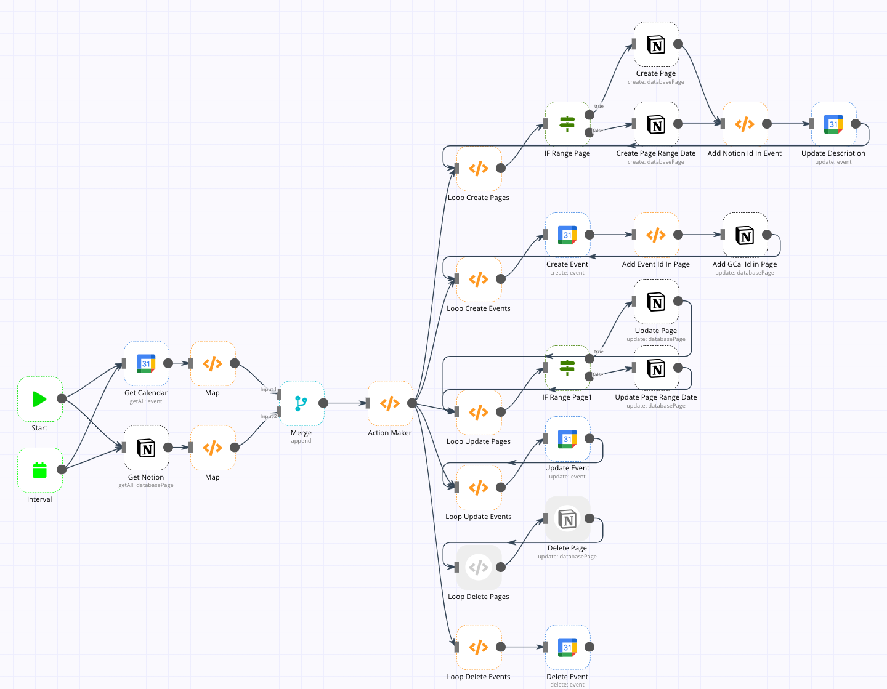

# My n8n workflow

```
Contribution Welcome!
```

- [My n8n workflow](#my-n8n-workflow)
  * [Notion mind map](#notion-mind-map)
    + [example](#example)
    + [Feature](#feature)
    + [Use](#use)
      - [Prerequisites](#prerequisites)
      - [Set And Run](#set-and-run)
      - [USAGE](#usage)
  * [[Upgrading]notion & google calendar 2 way sync](#-upgrading-notion---google-calendar-2-way-sync)
    + [Feature](#feature-1)
    + [Use](#use-1)
      - [Prerequisites](#prerequisites-1)
      - [Set And Run](#set-and-run-1)
      - [USAGE](#usage-1)
    + [Develop](#develop)
      - [Action Maker](#action-maker)
      - [Workflow](#workflow)

<small><i><a href='http://ecotrust-canada.github.io/markdown-toc/'>Table of contents generated with markdown-toc</a></i></small>

 
## Notion mind map


### Example


### Feature

- [x] 1 way sync(notion -> mind map)
- [x] sync every 1 second

### Use

#### Prerequisites

* linux
* docker
* docker-compose
* node v18

#### Set And Run

1. install npm(only linux)
    ```bash
    $ cd notion-mindmap
    $ npm install
    ```
2. run docker container
    ```bash
    $ docker-compose up -d
    ```
3. open and import workflow
    1. open http://localhost:5678
    2. Click `Workflows`(upper left)
    2. Click `Add workflow`
    3. Click three dot button and `Import from File`
    4. Select [`./notion-mindmap/Notion__Mindmap.json`](./notion-mindmap/Notion_mindmap.json)
4. Set Notion Credentials in n8n
    * Notion reference: https://docs.n8n.io/credentials/notion/
5. Change your notion information in workflow nodes(`Send notion credential`)
6. Set your n8n url in `Set Environments` node (ex. http://localhost:5678)
4. Active this workflows  
    check `Active` button (upper right)

#### USAGE

1. Copy notion page url(ctrl + l)
2. Add n8n connections in page(ref: `Set And Run > 4. Set Notion Credentials in n8n`)  
  
3. embed mindmap url in notion page (ex: http://localhost:5678/workflow/xxxx-xx-xx-xx?notion={notion url})

## [Upgrading]notion & google calendar 2 way sync



### Feature

- [x] sync every 20 minutes(default, you can change it)
- [x] create
    - [x] notion -> gcal
    - [x] gcal -> notion
- [x] update 
    > There is a bug with alternating updates for ranged all day. The result is no problem.
    - [x] notion -> gcal
    - [x] gcal -> notion
- [x] delete
    - [x] notion -> gcal
    - [ ] gcal -> notion
         > Notion do not support delete api
- [ ] support recurring events(coming soon)
- [ ] easy setup
    - [ ] combine setting data in workflow
- [ ] using offical n8n
    > When the task is finished, you can use it without installing docker.
    - [ ] contribute bug fix

### Use

#### Prerequisites

* docker

#### Set And Run

1. Pull and run docker container
    ```bash
    $ docker run -d --restart always -e N8N_PORT=5678 -v ./n8n:/home/node/.n8n -p 5678:5678 --name n8n 5pecia1/n8n-custom:latest
    ```
    > Current latest offical n8n have bug about notion and gcal.  
    > So, You use my custom n8n image.
4. Open and import workflow
    1. open http://localhost:5678
    1. Click `Workflows`(upper left)
    2. Click `Import from File`
    3. Select [`./notion-gcal-2way-sync/Notion__Calendar_Sync.json`](https://github.com/5pecia1/n8n-workflow/blob/main/notion-gcal-2-way-sync/Notion__Calendar_Sync.json)
5. Set Google OAuth Credentials, Notion Credentials in n8n
    * Google OAuth reference: https://docs.n8n.io/credentials/google/#using-service-account
    * Notion reference: https://docs.n8n.io/credentials/notion/
6. Make properties in Notion Page in DB
    * name: `GCal Id`, type: **text**
7. Change your calendar, notion information in workflow nodes  
    Nodes Chekclist
    * `Set Environments`
        * `notion date property`'s Value  
          `Start-End Time` change to your date property name in notion db
        * `time zone`'s Value
          find your timezone in [TZ database name](https://en.wikipedia.org/wiki/List_of_tz_database_time_zones)
    * `Get Notion`
        * Notion API
        * Database ID
    * `Get Calendar`, 
        * Google Calendar OAuth
        * Calendar ID
    * `Create Evnet`, `Update Description`, `Update Evnet`, `Delete Event`
        * Google Calendar OAuth
    * `Create Page`, `Create Page Range Date`, `Update Page`, `Update Page Range Date`
        * Notion API
8. Set Interval
    1. set interval in `Interval` node
2. test workflow  
    Click `Execute Workflow`(bottom)
4. Active this workflows  
    check `Active` button (upper right)

#### USAGE

* sync page to event
    * new page  
    Creating a property(ex. Start-End Time) of the base date in the page creates a new event.
    * update page  
    If you modify the property of the standard date in the page, the existing event is updated.
    * delete page  
    If you delete the property of the base date in the page, the event is deleted.
* sync evnet to page
    * new event  
    If you create an event by writing the event name after `notion:`, a new page is created.  
    example. `notion: this is new event name`
    * update evnet  
    Modifying the date of the event also modifies the date on the page.


### Develop

[notion-gcal-2-way-sync#README.md](./notion-gcal-2-way-sync/README.md)

#### Action Maker

#### Workflow
